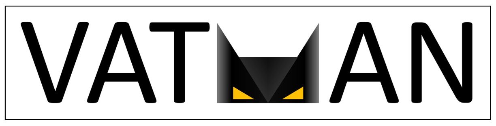

<p align="center">
  
  <br>
</p>

# VATMAN: Video Anomaly Transformer for Monitoring Accidents and Nefariousness (author implementation)

This repository contains our implementation of **"VATMAN: Video Anomaly Transformer for Monitoring Accidents and Nefariousness"** (AVSS IEEE 2024).


## Experimental Setup

We provide the network architecture of the proposed VATMAN model and share the pipeline code that enables users to train and test the network on the video feature dataset. 
The Transformer part used in asymmetric Autoencoder references the implementation provided by [lucidrains's repository](https://github.com/lucidrains/vit-pytorch). 
All experiments were conducted in an environment with `Python 3.8.12`, `PyTorch 1.12.1`, and `CUDA Toolkit 12.3`.

### Dataset and Hyperparameter Configuration

The parameters that users can modify, such as the paths to the training datasets and the hyperparameters, are primarily defined in `parameters.py`.

- **Dataset Configuration**

To locate the path of the dataset, you need to edit the following parameters in `parameters.py`.
They are only used to access the dataset and name the result file.
```python
#parameters.py
data_root_dir = '[ROOT PATH OF THE DATASETS]'

feature_extractor = '[THE NAME OF THE FEATURE EXTRACTOR USED TO EXTRACT FEATURE FROM VIDEO SEGMENT]'

anomaly_class = '[ANOMALY CLASS OF THE DATASET]'
```

The directory structure of the folder containing the daaset is as follows:
```plaintext
data_root_dir/
├── feature_extractor_1/
│   ├── anomaly_class_1/
│   │   ├── video1/
│   │   │   ├── segment_feature1.npy
│   │   │   ├── segment_feature2.npy
│   │   │   └── ...
│   │   └── ...
│   └── ...
└── ...
```
The `segment_feature` must have the vector shape [1, `embedding_dim`]. 
The `embedding_dim` can be changed by the feature extractor that you use. 
Then, you can simply adjust the following parameter.
```python
#parameters.py

embedding_dim = '[THE DIMENSION OF SEGMENT_FEATURE]'
```

The remaining parameters in `parameters.py` are static hyperparameters optimized in our dataset.
Therefore, you can adjust them for your experiments.
The batch size and learning rate are automatically tuned equally for all models used in the experiments, utilizing the hyperparameter tuning tool, Optuna ([link](https://optuna.org/)).

- **Setting the Experimental Results Path**

After configuring the dataset and hyperparameters, you will need to set the path for saving the experimental results. 
This can also be done in `parameters.py` using the variables `save_root_dir` and `exp_name`. 
`results_path` specifies the default directory where the experimental results will be saved, and `exp_name` defines the name of the current experiment.

- **Run the Experiment**
  
If you have completely finished setting up `parameters.py`, you can start the experiment by running the following command:
```python
python train.py
```

### Citation
If you utilize this code, please cite the following paper and star this repository:
```bibtex
@inproceedings{kim2024vatman,
  title={VATMAN: Video Anomaly Transformer for Monitoring Accidents and Nefariousness},
  author={Kim, Harim and Lee, Chang Ha and Hong, Charmgil},
  booktitle={2024 IEEE International Conference on Advanced Video and Signal Based Surveillance (AVSS)},
  pages={1--7},
  year={2024},
  organization={IEEE}
}
```
